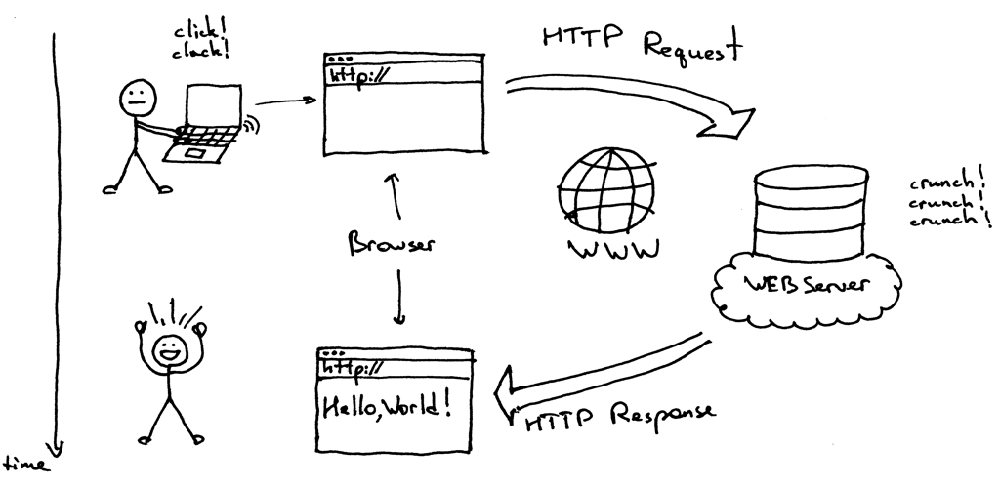

# Client-server

* Clients and servers exchange messages in a request–response messaging pattern.
* The client sends a request, and the server returns a response.
* A server may receive requests from many distinct clients.
* Clients work independently from each other.

Client side (frontend) | Server side (backend)
---------------------- | ---------------------
Send REQUEST ⇒ | ⇒ Receive REQUEST
Receive RESPONSE ⇐ | ⇐ Send RESPONSE

## Request

* Protocol (http, https, ftp)
* Host (www.example.com, gary.pp.ua, 91.203.4.101, localhost)
* Port (80, 443, 21, 22)
* Query (/js/script.min.js, /calendar.php?d=2017-02-03&view=hourly)
* Request method (GET, POST, PUT, DELETE, HEAD...)
* Headers (cookies, encoding, locale, user-agent, custom headers)
* Body ()

## Response

* Status code (200, 401, 403, 404, 500...)
* Headers (Server, Content-Type, Last-Modified, Content-Length, etc)
* Body (\<html>\<head>\<title>hello\</title>\</head>\<body><div class="wra......)

## Example

view-source:http://garik.pp.ua/prj/gh-request/?show-me

## Install

    npm install
    node server.js

## API (application programming interface)

example: https://git.ekreative.com/streamtime/streamtime-backend/blob/dev/README.md

    GET /q/:search
    
Response:

    {
        "matches": [
            "dolor",
            "do",
            "dolore",
            "Duis",
            "deserunt",
            "de",
            "doloremque",
            "dicta",
            "dolores",
            "dolorem"
        ]
    }
    
